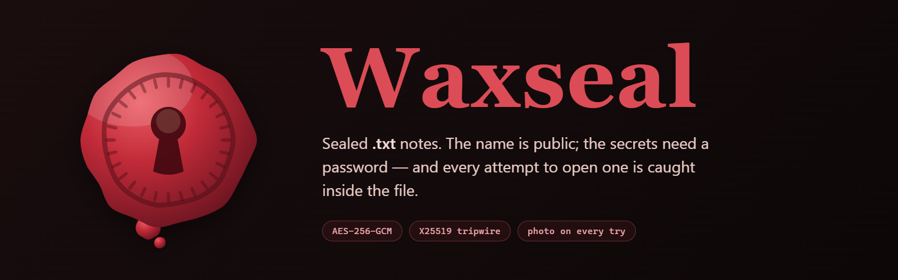

<p align="center">
  
</p>

<p align="center">
  
  
  
  
</p>

A note whose name is public and whose contents are not.

Every note is an ordinary `.txt` file. Open one in Notepad and you get its name,
the date it was sealed, and a wall of base64. Anyone sharing the PC can see that
"Bank stuff" exists. Only the password opens it — and **every attempt to open
it, right or wrong, is written into the file itself**: the password that was
typed *and a photo of whoever was at the keyboard*, readable by nobody but the
password holder.

```
WAXSEAL SEALED NOTE
Name:   Bank stuff
Sealed: 2026-08-15T07:29:39.275Z
------------------------------------------------------------------
The name above is public. Everything below is encrypted with AES-256-GCM
and opens only with this note password. Every attempt to open it - right
or wrong - is recorded inside this file, readable only by whoever knows
that password. Editing the block below destroys the note.
------------------------------------------------------------------
WAXSEAL1:
eyJ2IjoxLCJuYW1lIjoiQmFuayBzdHVmZiIsInNlYWxlZEF0IjoxNzg2Nzc4OTc5Mjc1...
```

## How the tripwire works

The obvious way to log break-in attempts does not work: writing the log needs a
key, and anyone who can write it can read it. Waxseal splits the two.

Each note carries an **X25519 keypair**. The public half sits in the clear, so
anybody who touches the note can seal a record of that attempt to it without
holding a single secret. The private half is wrapped under the password. An
intruder therefore *writes* into the log by trying, and can neither read what
they wrote nor pick it back out.

The rest of the shape:

| | |
|---|---|
| Password → key | scrypt, N=32768, r=8, p=1 |
| Letter | AES-256-GCM under a random per-note key |
| Wrong password | detected by the GCM tag — there is no password hash in the file to attack separately |
| Length hiding | the letter is padded to a 256-byte boundary, so file size does not give away how much you wrote |
| Log | ring buffer of the last 2000 attempts, each sealed to the note's public key |
| Photos | webcam frame taken on each attempt, downscaled to 320px JPEG and sealed to the public key; own ring of the last 30, and a wrong-password face is never dropped to keep a routine open |
| Keys in memory | held only by the main process, wiped on lock, on quit, and after 10 idle minutes |

## What someone without the password can and cannot do

**Can:** see the name and the sealed date, see roughly how big the note is
(rounded to a 256-byte bucket), see how many records the log holds, and delete
the file — nothing protects a file from someone who can delete it.

**Cannot:** read the letter, read who tried the password, read what they typed,
or see the photos taken of them. They also cannot remove their own entry from
the log without destroying the note, which is itself a signal.

The photo capture fails soft: no camera, or a camera the OS won't hand over,
just means the attempt is logged without a picture — it never blocks opening the
note. Nothing in the unlock dialog announces the camera, so an intruder is not
tipped off; the camera's own hardware light is the only outward sign, and that
is out of the app's hands.

## The letter is a book

Writing runs across fixed pages: fill one and the last words move onto the next,
delete and they come back up. Arrows either side of "Page 3 of 6" turn pages, as
do the ← → keys, PageUp/PageDown, and simply typing past the bottom. A page
break is only a position — join the pages and you get back exactly what was
written, so the format stays plain text.

## Running it

```bash
npm install
npm start          # run from source
npm test           # round-trip checks on the file format
npm run icon       # redraw build/icon.ico from the wax geometry
npm run dist       # build Waxseal-1.0.0-portable.exe and the installer
```

Notes live in `Documents\Waxseal Notes` by default; the folder is changeable
from the shelf, and notes kept elsewhere can be opened one at a time.

## Layout

```
core/sealed.js     the file format and all of the cryptography
core/store.js      the notes folder, atomic writes, filename safety
app/main.js        Electron main - the only holder of an unlocked note's keys
app/preload.js     the single bridge between the window and the disk
renderer/          the window: icons.js draws the wax, pages.js flows the book
tools/make-icon.js renders the .ico with no image library, straight from geometry
```

## Honest limits

- A lost password loses the note. There is no recovery and no back door.
- Someone who keeps a copy of the file before trying can restore it afterwards
  and erase their own entries. Keeping notes somewhere they cannot silently
  overwrite is the answer to that, not more cryptography.
- The build is unsigned, so Windows SmartScreen will warn on first run.
- Anything read out of a note lives in your clipboard and your screen like any
  other text. The seal ends at the app.

MIT.
